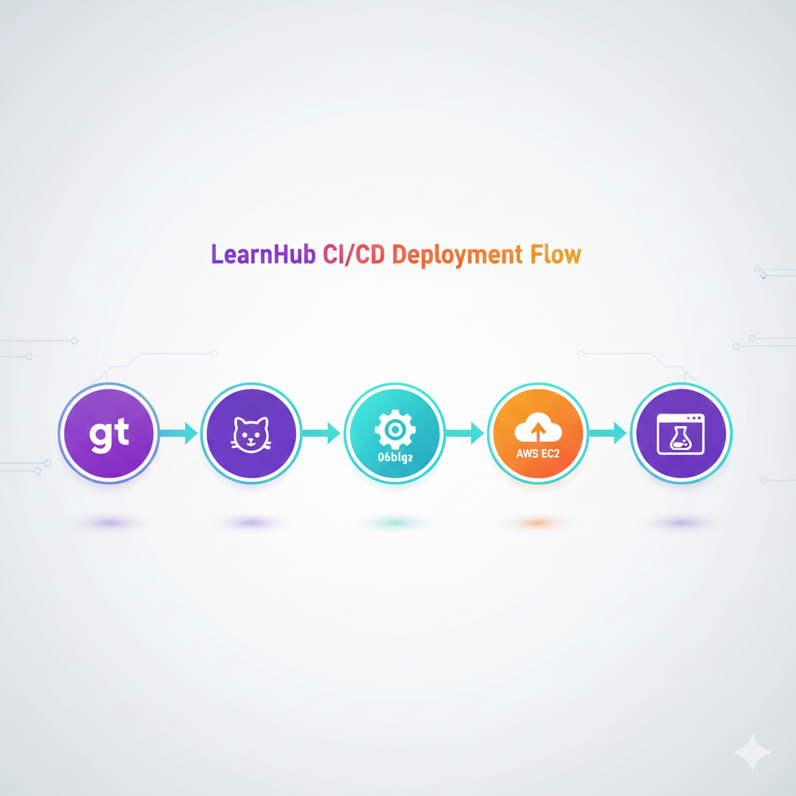

# 🚀 LearnHub — Flask CI/CD Deployment on AWS EC2

[](#)
[](https://www.python.org/)
[](#)

---

> **LearnHub** — A modern and production-ready Flask web application built with an automated Jenkins CI/CD pipeline and deployed seamlessly on AWS EC2.  
> Featuring a dynamic LearnHub theme with **Violet → Cyan → Orange** gradients and professional documentation.

---

## 🎨 Theme: Violet → Cyan → Orange (LearnHub Style)

| Color | Hex Code | Description |
|-------|-----------|-------------|
| Violet | `#6c63ff` | Primary accent for branding |
| Cyan | `#06b6d4` | Highlight & cool contrast |
| Orange | `#ff7d00` | Buttons, alerts & energy |
| Light | `#f8f9fa` | Background & cards |
| Dark | `#2a2a72` | Text & headers |

---

## 📸 Project Overview

> 

| Stage | Screenshot |
|--------|-------------|
| 🌐 **1. LearnHub Web Application (Running on EC2)** |  |
| ⚙️ **2. Jenkins CI/CD Build Success** |  |
| 💻 **3. GitHub Repository (Source Code)** |  |
| ☁️ **4. AWS EC2 Instance Dashboard** |  |
| 🧠 **5. VS Code Project Structure** |  |

---

## 🧠 Workflow Summary

| Stage | Description |
|--------|--------------|
| **1️⃣ Code Commit** | Push Flask app + Jenkinsfile to GitHub |
| **2️⃣ Jenkins Build Trigger** | Jenkins automatically pulls latest code |
| **3️⃣ Remote SSH Deploy** | SCP files → setup venv → install dependencies |
| **4️⃣ Start Server** | Flask app runs via Gunicorn on port `8000` |
| **5️⃣ Verify & Monitor** | Jenkins pipeline validates status and logs |

---

## ⚙️ Jenkins Pipeline Overview

```groovy
pipeline {
    agent any

    environment {
        REMOTE_HOST = "13.204.86.75"
        REMOTE_USER = "ubuntu"
        REMOTE_DIR = "/home/ubuntu/learnhub-app"
        APP_PORT = '8000'
    }

    stages {
        stage('Clone') { steps { echo 'Cloning GitHub repository...' } }
        stage('Deploy') { steps { echo 'Deploying to EC2 instance...' } }
        stage('Start') { steps { echo 'Starting Flask app with Gunicorn...' } }
        stage('Verify') { steps { echo 'Verifying deployment health...' } }
    }
}
```

---

## 🧰 Technologies Used

| Category | Tools |
|-----------|-------|
| **Frontend** | HTML, CSS, Inline Styling (Violet → Orange Gradient) |
| **Backend** | Flask (Python 3.12), Gunicorn |
| **DevOps** | Jenkins, AWS EC2, SSH Key Deploy |
| **Source Control** | Git, GitHub |
| **IDE** | Visual Studio Code |

---

## 🧩 Setup & Deployment Steps

### 🔹 Local Setup
```bash
git clone https://github.com/dalvipiyush07/Python-CI-CD.git
cd Python-CI-CD
python3 -m venv venv
source venv/bin/activate
pip install -r requirements.txt
python3 app.py
```

### 🔹 Remote Deployment (via Jenkins)
- Jenkins pulls the latest commit
- SCPs files to `/home/ubuntu/learnhub-app`
- Installs dependencies in `venv`
- Starts Gunicorn on port `8000`
- Verifies application health and logs output

---

## 🧩 Output URL
🌍 **Deployed App:** [http://13.204.86.75:8000](http://13.204.86.75:8000)

📊 **Jenkins Dashboard:** `http://3.111.38.9:8080/job/Python-app`

💾 **GitHub Repository:** [Python-CI-CD](https://github.com/dalvipiyush07/Python-CI-CD)

---

## 🏁 Final Notes

✨ This LearnHub CI/CD pipeline demonstrates a **professional DevOps implementation** using Jenkins + AWS EC2.  
💡 The theme reflects a vibrant **Violet → Cyan → Orange** palette inspired by modern EdTech design.  
🚀 Future Enhancements: Add SSL via Nginx reverse-proxy, automate database integration, and monitoring with Grafana/Prometheus.

---

## 💜 Author
**Piyush Dalvi**  
🌐 *DevOps | Python | Cloud Enthusiast*  
📘 GitHub: [dalvipiyush07](https://github.com/dalvipiyush07)

---

> _"Code. Automate. Deploy. Repeat."_ — Made with 💜 using Python, Jenkins & AWS EC2.

